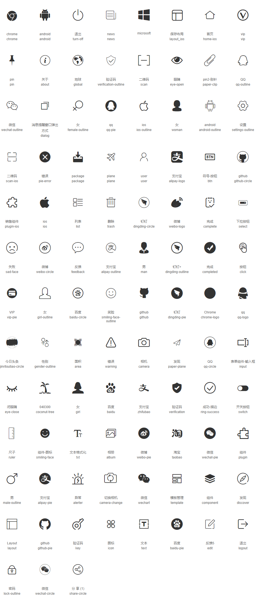

# AliIcons

Flutter 图标，包中使用的图标全部是从阿里图标库中挑选出来的

## Getting Started

### 1. Depend on it
Add this to your package's pubspec.yaml file:
```yaml
dependencies:
  ali_icons: ^0.0.2
```

### 2. Example
```dart
import 'package:ali_icons/ali_icons.dart';

void main() {
  runApp(Scaffold(
    body: Center(
      child: Icon(AliIcons.user_outline),
    ),
  ));
}
```

## 图标
